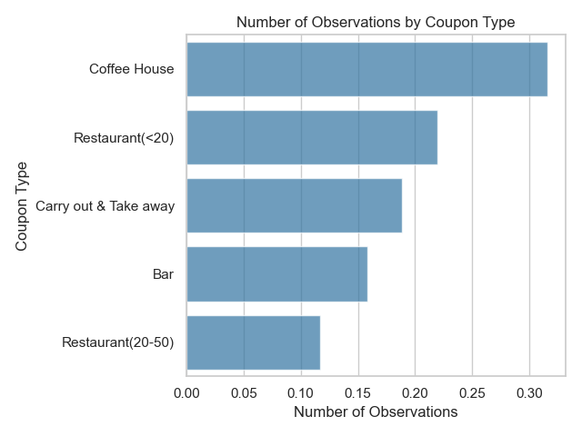
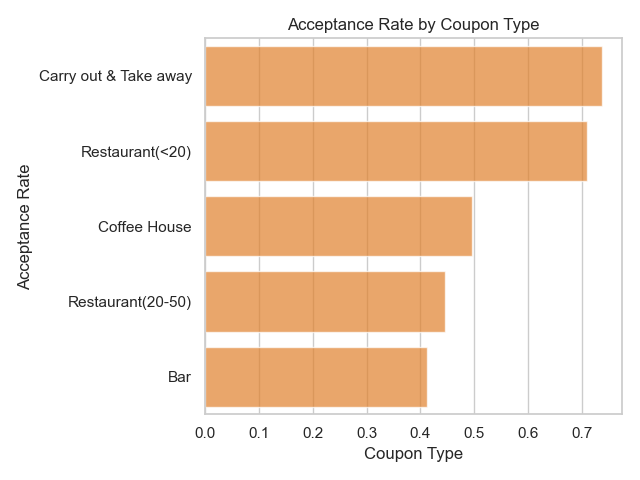

# Analysis on Coupon Acceptance Rates

Link to jupyter notebook: 

### Introduction
----

This report summarizes main findings from an analysis of coupons based on survey data collected from Amazon Mechnical Turk. The survey describes scenarios of drivers being offered coupons in a variety of situations, and the respondent decides whether to accept the coupon by driving there before the coupon expires. This report contains insights for effectively targeting coupons to drivers who are most likely to accept them. The key success metric is the acceptance rate, defined as the percent of drivers accepting coupons among those receiving them. 

### Types of Coupons
----

There are five types of coupons available in the data: coffee houses, bars, low-end restaurants (< $20), high-end restaurants (between $20-$50), and carry-out/take-away restaurants. Coffee house coupons are the most common (31.6%), followed by low-end restaurants (22.0%), carry-outs (18.9%), and bars (15.8%).

Among these coupons, carry-outs and low-end restaurants have the highest acceptance rates (70.9% - 73.8%), followed by coffee houses at 49.6%. Bar coupons have the lowest acceptance rates at 41.2%.

We will focus our deep dive on two types of coupons: bar coupons (which have the lowest acceptance rates) and coffee house coupons (which are the most common in the survey).

### Bar coupons
----

41.1% of drivers accept bar coupons, which is lower than the 56.9% acceptance rate across all coupons. Bar coupons can be effectively targeted to three categories of drivers:

#### Category 1: Drivers with Adult Passengers

Drivers are more likely to accept bar coupons if they are with other adult passengers who can drive the vehicle after drinking. Acceptance rates are higher by 34.6 pp for bar visitors above age 25+, and they are higher by 33.5 pp for drivers with adult passengers who are more likely able to drive (for drivers with non-farm/fish/forestry occupations).

#### Category 2: Non-Widowed Drivers

Drivers who have been widowed are less likely to accept bar coupons, perhaps due to past incidents related to drunk driving. Acceptance rates are higher by 33.5 pp for bar visitors who have never been widowed (for drivers with adult passengers).

#### Category 3: Low-Income Frequent Bar Visitors

Drivers are more likely to accept bar coupons if they are frequent bar visitors with lower incomes. Acceptance rates are higher by 38.9 pp for drivers who visited bars more than 3 times in the prior month. They are also higher by 5.4 pp for frequent visitors of cheap restaurants with incomes below $50,000.

### Coffee House Coupons
----

31.6% of all coupons in the survey are coffee house coupons, making it the most common coupon type in the survey. 49.6% of coffee house coupons are accepted by drivers, which is higher than bar coupons but lower than the overall acceptance rate across all coupons. Coffee house coupons can be effectively targeted to four types of drivers:

#### Type 1: Past Visitors of Coffee Houses

Coupon acceptance rates are higher by 31.8 pp for past visitors of coffee houses.

#### Type 2: Responsive Occupations and Education Groups

Certain occupations and educational attainment are predictive of higher acceptance rates. Acceptance rates are higher by 12.8 pp for students and non-college degree holders in building maintenance, healthcare, and transportation.

#### Type 3: Drivers in Coffee-Prone Weather

Drivers are less likely to accept coffee house coupons in colder weather. Acceptance rates are higher by 7.4 pp when the temperature is 80F or when there is no snow. 

#### Type 4: Drivers in Day-Time Social Situations

Drivers are more likely to accept coffee house coupons in daytime social situations. Acceptance rates are higher by 18.1 pp when there is no urgent destination, when they are with friends or partners, or in the afternoon (10 am - 2 pm).

### Conclusion
----

This report examined categories of drivers who are most likely to accept bar coupons and coffee house coupons. Bar coupons have the lowest acceptance rates, but they can be effectiely targeted to drivers with adult passengers, non-widowed drivers, and low-income frequent bar visitors. Coffee houses have higher acceptance rates, but they can be even higher by targeting them to past visitors of coffee houses, responsive occupations/education groups, drivers in coffee-prone weather, and drivers in social situations in the day time.

